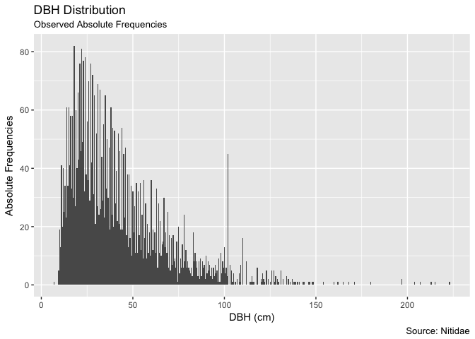
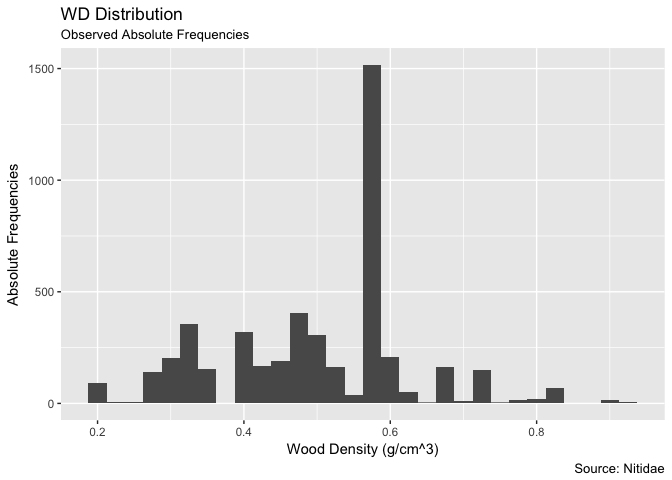
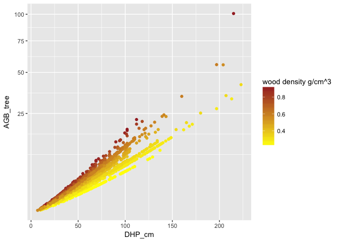
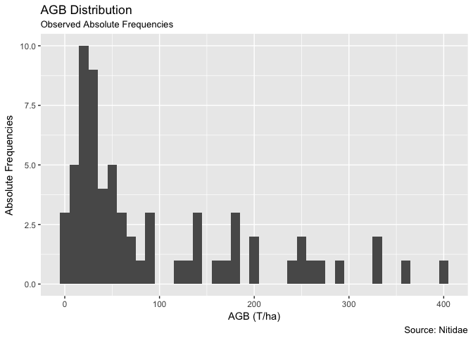

BIOMASS nitidae
================
Bruno Hérault
12/06/2018

-   [Data Importation](#data-importation)
    -   [Data Uploading](#data-uploading)
    -   [Basic Checks](#basic-checks)
-   [Biomass Computation](#biomass-computation)
    -   [per tree](#per-tree)
    -   [per plot/ha](#per-plotha)

Data Importation
================

Data Uploading
--------------

``` r
library(knitr)
library(readxl)
```

    ## Warning: package 'readxl' was built under R version 3.4.4

``` r
data<-read_excel("data.xls")
summary(data)
```

    ##  Id_Parcelle        Codification Parcelles Superficie en ha
    ##  Length:4771        Length:4771            Min.   :0.200   
    ##  Class :character   Class :character       1st Qu.:1.000   
    ##  Mode  :character   Mode  :character       Median :1.500   
    ##                                            Mean   :2.678   
    ##                                            3rd Qu.:3.500   
    ##                                            Max.   :8.200   
    ##  Nom_scientifique   wood density g/cm^3     DHP_cm       
    ##  Length:4771        Min.   :0.2110      Min.   :  7.006  
    ##  Class :character   1st Qu.:0.4090      1st Qu.: 23.000  
    ##  Mode  :character   Median :0.5230      Median : 35.500  
    ##                     Mean   :0.5028      Mean   : 42.478  
    ##                     3rd Qu.:0.5800      3rd Qu.: 55.000  
    ##                     Max.   :0.9260      Max.   :222.930

Basic Checks
------------

``` r
library(ggplot2)
ggplot(data, aes(x = DHP_cm)) +
        geom_histogram(binwidth = 0.5, alpha = 1)+
      labs(title="DBH Distribution", 
         subtitle="Observed Absolute Frequencies",
         caption="Source: Nitidae",
         x="DBH (cm)",
         y="Absolute Frequencies")
```



``` r
library(ggplot2)
ggplot(data, aes(x = `wood density g/cm^3`)) +
        geom_histogram(binwidth = 0.025, alpha = 1)+
      labs(title="WD Distribution", 
         subtitle="Observed Absolute Frequencies",
         caption="Source: Nitidae",
         x="Wood Density (g/cm^3)",
         y="Absolute Frequencies")
```



Biomass Computation
===================

per tree
--------

``` r
library(BIOMASS)
lat <- 6.02
long <- -3.47
coord <- cbind(long, lat)
data$AGB_tree <- computeAGB(data$DHP_cm, data$`wood density g/cm^3`, coord=coord)

sp<-ggplot(data, aes(x=DHP_cm, y=AGB_tree, color=`wood density g/cm^3`)) + geom_point()
sp+scale_color_gradient(low="yellow", high="brown")+scale_y_sqrt()
```



per plot/ha
-----------

``` r
library(ggplot2)
AGB_plot<-data.frame(Plot= unique(data$Id_Parcelle),
                     AGB= as.numeric(tapply(data$AGB_tree,data$Id_Parcelle, sum)))
unique<-(data.frame(Id_Parcelle=data$Id_Parcelle,Area=data$`Superficie en ha`))
test<-unique[!duplicated(unique), ]
AGB_plot<-merge(AGB_plot, test, by.x="Plot", by.y="Id_Parcelle")
AGB_plot$AGB_ha<-AGB_plot$AGB/AGB_plot$Area

ggplot(AGB_plot, aes(x = AGB_ha)) +
        geom_histogram(binwidth = 10, alpha = 1)+
      labs(title="AGB Distribution", 
         subtitle="Observed Absolute Frequencies",
         caption="Source: Nitidae",
         x="AGB (T/ha)",
         y="Absolute Frequencies")
```



``` r
kable(AGB_plot)
```

| Plot                     |           AGB|  Area|      AGB\_ha|
|:-------------------------|-------------:|-----:|------------:|
| Abe Abe Victorien        |    67.5935287|   0.4|  168.9838217|
| Abe Abe Victorien 2      |    33.8498002|   0.8|   42.3122502|
| Abe Atse Laurent         |    12.6082979|   0.8|   15.7603723|
| Abe Stanislas 1          |     9.8785547|   0.8|   12.3481933|
| Abe Stanislas 2          |    22.6639007|   0.8|   28.3298759|
| Abou Assi Maxime         |   163.4168351|   0.6|  272.3613918|
| Adou Messon Pacome       |    72.5318157|   0.4|  181.3295393|
| Adou Seka Renee 1        |     7.8257376|   0.5|   15.6514751|
| Adou Seka Renee 2        |    71.1450958|   1.5|   47.4300638|
| Aholia Yapo Calixte 2    |    40.0854872|   1.8|   22.2697151|
| Aholia Yapo Calixte 1    |    13.3468493|   0.6|   22.2447489|
| Aka Brou Suzanne         |   432.6979121|   3.3|  131.1205794|
| Assi Koman Félix         |     9.4987693|   0.3|   31.6625643|
| Assi Assi Stéphane       |   164.6883424|   1.8|   91.4935235|
| Assi Azoua Thérèse       |    25.4138379|   2.2|   11.5517445|
| Assi Det Étienne         |    36.1894996|   1.7|   21.2879409|
| Assi Kottia Dominique 1  |    80.6006383|   2.1|   38.3812563|
| Assi Kottia Dominique 2  |    55.9116002|   1.8|   31.0620001|
| Assi Niangoran Bernard 2 |    75.1789391|   1.5|   50.1192928|
| Assi Niangoran Bernard 1 |    70.7351721|   0.4|  176.8379303|
| Assi Yapi Laurent        |    29.0592340|   1.4|   20.7565957|
| Atse Diane Augustin 1    |     9.3472030|   0.3|   31.1573434|
| Atse Diane Augustin 1    |     0.5400347|   0.3|    1.8001156|
| Atse Diane Augustin 2    |    69.2583176|   1.5|   46.1722118|
| Diane Beda Émile         |    80.4611378|   2.0|   40.2305689|
| Eba Abazin Étienne       |    91.5454736|   2.0|   45.7727368|
| Esse Brou Marc           |    24.1200491|   1.1|   21.9273174|
| Gnineka Vincent          |   109.1527020|   0.7|  155.9324314|
| Kassin Kassin Jérôme 1   |   136.1754902|   1.5|   90.7836602|
| Kassin Kassin Jérôme 2   |    26.4519349|   0.4|   66.1298373|
| Kassin Kassin Jérôme 3   |    54.7216241|   1.7|   32.1891906|
| Kassin Kouassi Mickaël   |    57.1797973|   0.8|   71.4747467|
| Kemet Apo Anne-Marie     |  1515.4532134|   8.2|  184.8113675|
| Kemin Kemin Serges 1     |     3.3581855|   0.7|    4.7974079|
| Kemin Kemin Serges 2     |   350.3291713|   1.2|  291.9409761|
| Koba Amon Joachim 1      |   710.7987608|   3.5|  203.0853602|
| Koba Amon Joachim 2      |    74.9661362|   1.4|   53.5472401|
| Koba Anon Martial        |    61.5751036|   1.0|   61.5751036|
| Koba Yapo Éric           |    35.2182876|   0.9|   39.1314306|
| Kondo Maurice            |     8.5606576|   0.3|   28.5355253|
| Kottia Assi Blaise       |   126.2132358|   0.5|  252.4264717|
| Kottia Bernard           |   352.7590425|   1.5|  235.1726950|
| Kouame Kognan Julien     |   139.9559339|   1.0|  139.9559339|
| Kouassi Félix 1          |   234.2427283|   0.9|  260.2696981|
| Kouassi Félix 2          |   353.9367939|   1.4|  252.8119956|
| Kouassi Koko Pauline     |    31.3701743|   1.6|   19.6063589|
| Kouassi Jean Bosco       |    10.1641617|   0.9|   11.2935130|
| Kouassi Kouassi Richard  |   157.7577554|   1.3|  121.3521195|
| Kouassi Yapo Hilaire     |    29.7436399|   0.5|   59.4872799|
| Kpome Kognan Frédéric    |    39.0747581|   1.2|   32.5622984|
| Messon Hélène            |    44.9049412|   0.5|   89.8098824|
| Monset Tondoh Jérémie    |  1383.5185713|   4.2|  329.4091836|
| N' cho N'cho Roger       |   404.4453708|   1.0|  404.4453708|
| N'Da Asseu 1             |    27.3204572|   0.2|  136.6022858|
| N'Da Asseu 2             |    39.2026862|   0.2|  196.0134308|
| N'Da Asseu 3             |    61.0562563|   0.8|   76.3203204|
| N'Da Yapo Anderson       |    82.6122748|   0.6|  137.6871247|
| N'cho miltiade 1         |     8.0640090|   1.2|    6.7200075|
| N'cho miltiade 2         |     0.3112171|   0.4|    0.7780427|
| Niangoran Christophe     |    18.9237815|   0.6|   31.5396358|
| Niangoran N'cho Clément  |    19.1609540|   0.3|   63.8698466|
| Niangoran N'Da Louis     |    17.0966988|   0.7|   24.4238554|
| Yapi Diane Bernard 1     |    36.3530667|   4.8|    7.5735556|
| Yapi Diane Bernard 2     |    16.8475020|   1.1|   15.3159109|
| Yapi Diane Sylvestre     |    12.9365285|   0.4|   32.3413213|
| Yapi det Marcel 1        |   232.8491476|   0.7|  332.6416394|
| Yapi det Marcel 2        |   177.7418826|   0.5|  355.4837652|
